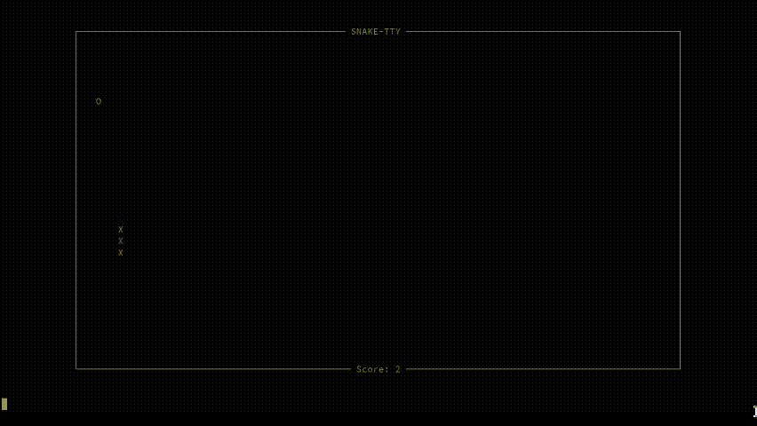

# Snaketty

A classic Snake game implementation in Rust that runs directly in your terminal!



## Features
- Classic snake gameplay mechanics.
- Screen size adaptation.

## Dependencies
- Rust (1.65+).
- Cargo.
- `termion` (terminal handling).
- `k_board` (keyboard input).
- `rand` (random number generation).

## Installation
Ensure Rust and Cargo are installed:
```bash
git clone https://github.com/yourusername/snaketty.git
cd snaketty
cargo run --release
```

## Controls

- Arrow keys: Change direction.
- Space: Start/Restart game.
- Escape: Quit game.

## How to Play

- Start the game with Space.
- Collect food (O) to grow and increase score.
- Avoid colliding with yourself.
- The snake wraps around screen edges.
- Press Escape to exit anytime.

## Configuration

Modify src/main.rs to:
- Change FPS (line with let fps: u64 = 60;).
- Adjust game window size percentage (look for 0.8 in Screen::new).
- Modify characters used for snake and food (search for 'X' and 'O').

## LICENSE

This project is licensed under [GPLv3](LICENSE).
